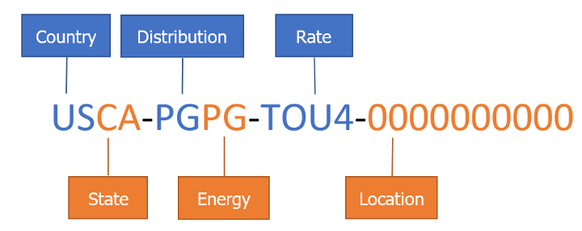

Market Informed Demand Automation Server (MIDAS) Documentation
==============================================================

_Interacting with the MIDAS API_

[[_TOC_]]

# Introduction

The California Energy Commission’s (CEC) Market Informed Demand Automation Server (MIDAS) is a database and application programming interface (API) that provides access to current, future, and historic time-varying rates, greenhouse gas (GHG) emissions associated with electrical generation, and California Flex Alert Signals. The database is populated by utilities and community choice aggregators (CCAs), WattTime’s Self-Generation Incentive Program (SGIP) marginal GHG emissions API, the California Independent System Operator (California ISO), and other entities that are registered with the MIDAS system.

MIDAS is designed to provide energy users with the electricity price information they need to optimize when they use energy. While it would be useful for electricity users to be able to use the data from MIDAS to try to estimate electricity bill totals, some billing structures such as tiered rates make this impossible without private customer-specific data. MIDAS does not and will not contain any private information. The only non-public data in MIDAS is login information.

MIDAS is accessible through a public API at <https://midasapi.energy.ca.gov> in two standard machine-readable formats: JavaScript Object Notation (JSON), and extensible markup language (XML). MIDAS is public and accessible for all registered users to query and download information by interacting with the MIDAS API. Registration is a simple process available through the API. CEC strongly encourages load serving entity (LSE) users have programming skills and software to effectively upload and maintain rate information stored in the database. Non-LSE users should be able to retrieve information stored in MIDAS without extensive programming skills. Retrieving MIDAS-hosted data can be easily done through the code examples provided or through a user’s own code. For instructions on accessing the MIDAS database, see [Getting Information from MIDAS](#getting-information-from-midas).

MIDAS was developed to support the CEC's [Load Management Standards](https://www.energy.ca.gov/proceedings/energy-commission-proceedings/load-management-rulemaking). The full text of the standards is available from [Westlaw](https://govt.westlaw.com/calregs/Browse/Home/California/CaliforniaCodeofRegulations?guid=ID6B950105CCE11EC9220000D3A7C4BC3).


# Database Structure

The MIDAS database supports retrieval of electric utility price schedules, California Flex Alert signals, and marginal GHG emissions from electrical generation. Flex Alerts and GHG emissions values – both forecasted and real-time - are continually retrieved from the California ISO Flex Alert site and WattTime’s SGIP API respectively. GHG realtime and forecasted values are cached, or temporarily stored, within MIDAS until new values are available while Flex Alerts are passed through MIDAS from the California ISO website, as a user queries MIDAS. Previous real-time values are moved to the HistoricalData table automatically. A record of previously active Flex Alerts and historic GHG emissions are stored in the HistoricalData table.

Pursuant to the California Load Management Standards, the state’s largest utilities and CCAs are responsible for populating the MIDAS database Holiday table, RateInfo table, and the Value table with all time-varying rate information and values offered to customers. For upload examples, please see [Appendix A](appendix-a.md). For instructions on how to retrieve the XML upload schema, please see section 3.

The primary lookup identification (ID) for the MIDAS database is a compound key comprised of six individual fields that make up a standardized rate identification number (RIN) as shown in Figure 1. RINs are assigned at the time rate information is first uploaded by the LSE through the MIDAS API. When an LSE uploads to an existing RIN, the correct RIN must be used at the time of upload. Figure 1 illustrates the six identifiers that comprise a RIN: Country, State, Distribution, Energy, Rate, and Location. The location portion of the RIN may consist of 1 to 10 characters depending on the specified location’s requirements.

Figure 1. Rate Identification Number Structure<br>
<br>
Source: California Energy Commission

Rate Indentification Numbers do not change over time. The prices and values may change, but an electricity customer's RIN should not change unless their rate components or rate modifiers change or the utility or customer changes their rate tarrif.

## Rate Information

To fulfill the requirements of the California's load management standards, MIDAS receives and shares information for all time-dependent rates for the three largest investor owned utilities (IOUs), the two largest publicly owned utilities (POUs) and the 12 largest CCAs in California. Time-dependent rates are rates that have prices which vary over the course of a day. Other California utilities and CCAs may use MIDAS to provide information and prices for their rates, but are not required to do so.

## SGIP GHG Emissions

WattTime estimates GHG emissions for 11 regions across the state of California providing real-time and forecasted values for each. MIDAS includes a total of 33 different GHG RINS for California - real-time, forecasted, and historic. RINs with the first 12 characters USCA-SGIP-SGRT-XXXX, USCA-SGIP-SGFC-XXXX, and USCA-SGIP-SGHT-XXXX allow access to the GHG information retrieved from the [WattTime.org SGIP API](https://sgipsignal.com) by MIDAS. The portion of the RIN specified as “SGRT” stands for “SGIP real-time”, “SGFC” stands for “SGIP forecast”, and “SGHT” stands for “SGIP historic”. The SGRT RIN will return only one data point that specifies the current CO2 level for the specified region. The SGFC RIN will return the forecasted CO2 levels, at 5-minute intervals, available from the WattTime API. SGHT RINs will return the historic information for each SGIP GHG emissions region. Once a real-time emissions value is replaced with a new current value, the information is moved to the HistoricalData table where it can be retrieved through the SGHT RIN. For a list of the regions and region abbreviations please see WattTime’s SGIP webpage at: <https://sgipsignal.com/grid-regions>.

## CAISO Flex Alerts

MIDAS includes three different Flex Alert RINS - real-time, forecasted, and historic values with dates and times of previous Flex Alerts. The California ISO maintains information as to whether there is an active Flex Alert and whether one is planned. MIDAS checks the California ISO Flex Alert web page for Flex Alerts and adds it to the database.

RINs of USCA-FLEX-FXRT-0000 and USCA-FLEX-FXFC-0000 check for CA ISO Flex Alerts at the moment a query is initiated through the MIDAS API. The result is passed through to the querying user directly. The “FXRT” portion of the first RIN stands for “Flex Alert real-time” and “FXFC” in the second RIN stands for “Flex Alert forecasted”. In the RIN USCA-FLEX-FXHT-0000, “FXHT” stands for “Flex Alert historical”. All previously active Flex Alerts will be reflected in the information retrieved with this RIN.
For more information on the XML schema and uploads, see [Appendix A](appendix-a.md).

## Archived Data in the HistoricalData Table

MIDAS stores uploaded data in the HistoricalData table to provide a durable record of rate information. Each time an LSE account, whether a distribution or energy company, uploads new rate information, the uploaded information is also added to the HistoricalData table. For example, if an LSE user designated as a distribution company uploads a new file with values for one RIN, that data will be added to the HistoricalData table at the same time it is added to the Value table.
The data in the HistoricalData table will always be up to date as well as providing a historical record. The information in the HistoricalData table can then be queried through the HistoricalData endpoint.


# Getting Information From MIDAS

The MIDAS API is a Representational State Transfer Application Programming Interface (RESTful API) accessible using any programming language able to create instances of a Hypertext Transfer Protocol (HTTP) Client, HTTP Request and HTTP Response classes. Users may develop their own in-house software to connect with the MIDAS RESTful API. The requests (calls) and responses should be executed asynchronously. Most software for interacting with APIs will allow easy interaction with the MIDAS API.

The MIDAS REST API and Database are protected by the CEC firewall and data throttling to prevent distributed denial of service (DDoS) attacks (see [Appendix D](appendix-d.md)). If an error occurs after an API call, the program will send a notification for CEC information technology (IT) staff to fix the issue.

The MIDAS API is comprised of six endpoints:

* Registration: Use POST to create a new account.
* Token: Use GET to retrieve a temporary token for interacting with the MIDAS API. Tokens must be passed to every API call except Registration and Token.
* Holiday: Use GET to retrieve the list of all holidays. LSE accounts may use POST to populate the Holiday table.
* ValueData: Use GET to retrieve a list of available rates (RINs), rate information, the XML schema, or lookup tables. LSE accounts may use POST to upload data to the RateInfo and Value tables.
* HistoricalData: Use GET to retrieve historic rate information.
* HistoricalList: Use GET to retrieve the list of rates (RINs) available from HistoricalData.

The following are instructions for registering a MIDAS account and a description of the basic functions that can be used to upload and download MIDAS data. The examples use the Python programming language. Links to GitHub repositories with examples in Python and other programming languages are in [Example Code](#example-code) below.

## Register

There are two types of accounts that can be used to interface with MIDAS: LSE accounts and user accounts. For security and accuracy of the system, only CEC-verified LSE accounts can upload (POST) data. Those wishing to retrieve data stored in the MIDAS database must register a user account and use that account to retrieve an access token to authenticate GET and POST requests.

User accounts can only query (GET) data from MIDAS, with the exception of registering for an account using the Registration endpoint.

1. User Accounts: User account registrants may include researchers, automation service providers, technology manufacturers, etc. Registration is done through the API by making a one-time call to the MIDAS registration endpoint with the required parameters. If no errors occur, this process will send an email to the email address specified as a parameter to the call. The user must then respond to the email before they can request a token. User account holders cannot post data.

2. LSE Accounts: New accounts for utilities and community-choice aggregators will follow the same registration process as User accounts. Following a successful registration, send an email to midas@energy.ca.gov from your LSE account to request access.  Accounts must be verified by a CEC staff member on the MIDAS support team to allow LSE-level access. An LSE account may only be registered under one distribution or energy company, allowing upload capabilities under only one company.

A successful registration will return: “User account for [your username] was successfully created. A verification email has been sent to [your email]. Please click the link in the email to start using the API.” The email address provided as part of registration will only be used for verification and infrequent communication about the MIDAS API.

For forgotten passwords or usernames please follow the links below:

Password: <https://midasweb.energy.ca.gov/Pages/AccountMaint/ForgotPassword>

Username: <https://midasweb.energy.ca.gov/Pages/AccountMaint/ForgotUsername>

**Endpoint:** `/Registration`

**HTTP Request:** `POST https://midasapi.energy.ca.gov/api/Registration`

**Authorization:** None

**Query Parameters:** None

**Body Parameters:**

When registering, the body of the uploaded XML or JSON has the following fields:

| Name                         | Description                                   | Type   |
|------------------------------|-----------------------------------------------|--------|
| fullname <br> _required_     | The full name for the user, encoded as base64 | string |
| username <br> _required_     | Requested user name, encoded as base64        | string |
| password <br> _required_     | Password, encoded as base64                   | string |
| emailaddress <br> _required_ | Email address, encoded as base64              | string |
| organization                 | Name of organization, encoded as base64       | string |

**Python Example**

```python
import requests
import json
import base64

# Encode registration values as base64
fullname = "<your full name>"
fullname_encodedBytes = base64.b64encode(fullname.encode("utf-8"))
fullname64 = str(fullname_encodedBytes, "utf-8")

username = "<your requested username>"
user_encodedBytes = base64.b64encode(username.encode("utf-8"))
username64 = str(user_encodedBytes, "utf-8")

password = "<your password>"
pswd_encodedBytes = base64.b64encode(password.encode("utf-8"))
password64 = str(pswd_encodedBytes, "utf-8")

emailaddress = "<your email address>"
email_encodedBytes = base64.b64encode(emailaddress.encode("utf-8"))
emailaddress64 = str(email_encodedBytes, "utf-8")

# organization is optional
organization = "<your organization>"
org_encodedBytes = base64.b64encode(organization.encode("utf-8"))
organization64 = str(org_encodedBytes, "utf-8")

# Put together the dict for the JSON payload
registration_info = {"organization":organization64, "username":username64, "password":password64, "emailaddress":emailaddress64, "fullname":fullname64}

url = 'https://midasapi.energy.ca.gov/api/registration'
headers =  {"Content-Type":"application/json"}

response = requests.post(url, data = json.dumps(registration_info), headers = headers)

# Will return HTTP Status Code 200 response for successful call
print(response)
# Response text should be: 'User account for <your_user_name> was successfully created. A verification email has been sent to <your_email>. Please click the link in the email in order to start using the API.'
print(response.text)
```

## GET a Token

After registering and verifying your email address, you can make a GET call to the token endpoint with username and password credentials to receive a token string. This token will expire after 10 minutes. During those 10 minutes, the token can be used to call all other endpoint actions as many times as desired up to the request rate limit. Pass the token with each call made to the system to allow access to the MIDAS database.

**Endpoint:** `/Token`

**HTTP Request:** `POST https://midasapi.energy.ca.gov/api/Token`

**Authorization:** Basic

**Python Example**

```python
import requests
import json
import base64

username = "<your username>"
password = "<your password>"

credentials = username + ":" + password
credentials_encodedBytes = base64.b64encode(credentials.encode("utf-8"))

headers = {b'Authorization': b'BASIC ' + credentials_encodedBytes}
url = base_url + '/token'

response = requests.get(url, headers = headers)

# Will return HTTP Status Code 200 response for successful call
print(response)
print(response.text)

token = response.headers['Token']
print(token)
```

## GET RIN List

To receive a list of RINs in the MIDAS database, users may query the API using the GET RIN List call. This call is part of the ValueData endpoint with a parameter that identifies the signal type of the RINs being returned. The signal type parameter will return all the RINs of the requested type:

0.	All
1.	Electricity rates
2.	Greenhouse gas emissions
3.	California Independent System Operator Flex Alert

**Endpoint:** `/ValueData`

**HTTP Request:** `POST https://midasapi.energy.ca.gov/api/ValueData?SignalType={SignalType}`

**Authorization:** Bearer

**Query Parameters:**

| Name                         | Description                                   | Example | Type   |
|------------------------------|-----------------------------------------------|---------|--------|
| SignalType <br> _required_   | The requested signal type 0-3                 | 1       | integer |

**Body Parameters:** None

**Response Description:**

Collection of RateInfo, each entry includes the following:<br>
| Name    | Description                                   | Example | Type   |
|--------|-----------------------------------------------|---------|--------|
| RateID | The rate identification number (RIN)        | "USCA-TSTS-TTOU-TEST" | string |
| SignalType | The signal type in string format        | "Rates" | string |
| Description | Includes human readable Distribution and Energy providers | "Rate Data for Distributor: Test, Energy Company: Test" | string |

**Python Example**

```python
import requests
import json

# SignalType 1 returns electricity rates
signaltype = '1'

headers = {'accept': 'application/json', 'Authorization': "Bearer " + token}
url = base_url + '/valuedata?signaltype=' + signaltype
list_response = requests.get(url, headers = headers)

# Pretty print response
print(json.dumps(json.loads(list_response.text), indent = 2))
```

## GET Values

Use this query to receive values and other information on a specified RIN. Pass a RIN with parameter RealTime to return the current value, or AllData to the ValueData endpoint to return the full schedule in either XML or JSON, as indicated in the header.

**Endpoint:** `/ValueData`

**HTTP Request:** `POST https://midasapi.energy.ca.gov/api/ValueData?ID={ID}&QueryType=(QueryType)`

**Authorization:** Bearer

**Query Parameters:**

| Name                         | Description                                   | Example | Type   |
|------------------------------|-----------------------------------------------|---------|--------|
| ID <br> _required_   | The RIN for the requested rate               | "USCA-TSTS-TTOU-TEST" | string |
| QueryType <br> _required_ | The requested data type, either "alldata" or "realtime" | "alldata" | string |

**Body Parameters:** None

**Response Description:**

Rate Information will include the following fields:<br>
| Name    | Description                                   | Example | Type   |
|--------|-----------------------------------------------|---------|--------|
| RateID | The rate identification number (RIN)        | "USCA-TSTS-TTOU-TEST" | string |
| SystemTime_UTC | The time of the response in UTC | "2023-03-21T16:34:42.906Z" | string |
| RateName | The name of the rate as provided by uploading party | "CEC TEST24HTOU" | string |
| RateType | The type of rate, from the RateType table | "Time of use" | string |
| Sector | The sector where the rate applies, from the Sector table | "All" | string |
| API_Url | The API URL as provided by uploading party | "http://example" | string |
| RatePlan_Url | Link to rate schedule as provided by uploading party | "http://example" | string |
| EndUse | The end use where the rate applies, from the EndUse table | "All" | string |
| AltRateName1 | An alternate name of the rate as provided by uploading party | "TEST-TOU" | string |
| AltRateName2 | Another alternate name of the rate as provided by uploading party | "TESTING TOU" | string |
| SignupCloseDate | The last day to sign up for the rate as provided by uploading party | "2025-12-31" | string |
| ValueInformation | Collection of ValueData as descipbed in the next table |  | Collection of ValueData |

ValueData collection will each include the following fields:<br>
| Name    | Description                                   | Example | Type   |
|--------|-----------------------------------------------|---------|--------|
| ValueName | A description of the value  | "Summer on peak" | string |
| DateStart | Date of pricing period start, in UTC | "2023-03-01" | string |
| DateEnd | Date of pricing period end, in UTC | "2023-03-01" | string |
| DayStart | Day type of pricing period, from DayType table | "Wednesday" | string |
| DayEnd | Day type of pricing period, from DayType table | "Wednesday" | string |
| TimeStart | Time of pricing period start, in UTC | "08:00:00" | string |
| TimeEnd | Time of pricing period end, in UTC | "08:59:59" | string |

Combining DateStart with TimeStart is the UTC datetime for the start of the period, and combining DateEnd with TimeEnd is the UTC datetime for the start of the period.

**Python Example**

```python
import requests
import json

queryType = 'alldata'

rateID = 'USCA-TSTS-TTOU-TEST'
headers = {'accept': 'application/json', 'Authorization': "Bearer " + token}
url = 'https://midasapi.energy.ca.gov/api/valuedata?id=' + rateID + '&querytype=' + queryType
pricing_response = requests.get(url, headers = headers)

# Will return HTTP Status Code 200 response for successful call
print(pricing_response)
print(json.dumps(json.loads(pricing_response.text), indent = 2))
```

## GET Lookup Table

To get the values stored in each lookup table, use the GET Lookup Table call. This call is part of the ValueData endpoint with a parameter that identifies the relevant lookup table. Possible lookup tables include Country, Daytype, Distribution, Enduse, Energy, Location, Ratetype, Sector, State, and TimeZone. The returned data will have the upload code and description for the specified lookup table. See [Appendix C](appendix-c.md) for more detail on the lookup tables.

**Endpoint:** `/ValueData`

**HTTP Request:** `POST https://midasapi.energy.ca.gov/api/ValueData?LookupTable={LookupTable}`

**Authorization:** Bearer

**Query Parameters:**

| Name                         | Description                                   | Example | Type   |
|------------------------------|-----------------------------------------------|---------|--------|
| LookupTable <br> _required_   | The name of the requested lookup table       | "Energy" | string |

**Body Parameters:** None

**Response Description:**

Rate Information will include the following fields:<br>
| Name    | Description                                   | Example | Type   |
|--------|-----------------------------------------------|---------|--------|
| UploadCode | The code used during rate uploads        | "PG" | string |
| Description | Human readable description of the code | "Pacific Gas and Electric" | string |

**Python Example**

```python
import requests
import json

LookupTable = 'Energy'

headers = {'accept': 'application/json', 'Authorization': "Bearer " + token}
url = 'https://midasapi.energy.ca.gov/api/valuedata?' + 'LookupTable=' + LookupTable
pricing_response = requests.get(url, headers = headers)
response = requests.get(url, headers = headers)
# Pretty print the JSON response
print(json.dumps(json.loads(pricing_response.text), indent = 2))
```

## GET Holiday Information

Holidays that apply to rates are stored in the Holiday table. There is no parameter to be specified.

**Endpoint:** `/Holiday`

**HTTP Request:** `POST https://midasapi.energy.ca.gov/api/Holiday`

**Authorization:** Bearer

**Query Parameters:** None

**Body Parameters:** None

**Response Description:**

Holiday Information will include the following fields:<br>
| Name    | Description                                   | Example | Type   |
|--------|-----------------------------------------------|---------|--------|
| EnergyCode | The code for the energy provider to which the holiday applies | "PG" | string |
| EnergyDescription | Human readable description of the energy code | "Pacific Gas and Electric" | string |
| DateOfHoliday | Local time datetime of the holiday | "2023-12-25T00:00:00" | datetime |
| HolidayDescription | Human readable description of the holiday | "Christmas 2023" | string |

**Python Example**

```python
import requests
import json

LookupTable = 'Energy'

headers = {'accept': 'application/json', 'Authorization': "Bearer " + token}
url = 'https://midasapi.energy.ca.gov/api/valuedata?' + 'LookupTable=' + LookupTable
pricing_response = requests.get(url, headers = headers)
response = requests.get(url, headers = headers)
# Pretty print the JSON response
print(json.dumps(json.loads(pricing_response.text), indent = 2))
```

## GET Historical RIN List

This call will retrieve all RINs with information stored in the HistoricalData table for the requested Distribution and Energy providers. These RINs will include all rates with current rate information in the Value table as well as rates that have been discontinued. All Flex Alert and GHG Emission historical RINs are automatically returned when querying any distribution or energy company.

**Endpoint:** `/HistoricalList`

**HTTP Request:** `POST https://midasapi.energy.ca.gov/api/HistoricalList?DistributionCode={DistributionCode}&EnergyCode={EnergyCode}`

**Authorization:** Bearer

**Query Parameters:**

| Name    | Description                                   | Example | Type   |
|--------|-----------------------------------------------|---------|--------|
| DistributionCode | The code for the distribution provider, one of those in the Distribution table | "PG" | string |
| EnergyCode | The code for the energy provider, one of those in the Energy table | "PG" | string |

**Body Parameters:** None

**Response Description:**

Collection of RateInfo, each entry includes the following:<br>
| Name    | Description                                   | Example | Type   |
|--------|-----------------------------------------------|---------|--------|
| RateID | The rate identification number (RIN)        | "USCA-TSTS-TTOU-TEST" | string |
| SignalType | The signal type in string format        | "Rates" | string |
| Description | Includes human readable Distribution and Energy providers | "Rate Data for Distributor: Test, Energy Company: Test" | string |

**Python Example**

```python
import requests
import json

DistributionCode = 'TS'
EnergyCode = 'TS'

headers = {'accept': 'application/json', 'Authorization': "Bearer " + token}
url = 'https://midasapi.energy.ca.gov/api/historicallist?' + 'DistributionCode=' + DistributionCode + '&EnergyCode=' + EnergyCode
list_response = requests.get(url, headers = headers)
# Pretty print JSON response
print(json.dumps(json.loads(list_response.text), indent = 2))
```

## GET Historical Rate Data

To receive historical information, all accounts may query the GET RIN History Data call. This call is part of the HistoricalData endpoint. Pass a RIN with a parameter that identifies the “startdate” and “enddate” to return historic values for the specified RIN during that timeframe in XML or JSON as specified in the header. Please note, only historic RINs may be used in this call. For example, GHG and Flex Alert RINs use different RINs to access historical values. See [CAISO Flex Alerts](#caiso-flex-alerts) and [SGIP GHG Emissions](#sgip-ghg-emissions) above for details.

**Endpoint:** `/HistoricalData`

**HTTP Request:** `POST https://midasapi.energy.ca.gov/api/HistoricalData/{id}?startdate={startdate}&enddate={enddate}`

**Authorization:** Bearer

**Query Parameters:**

| Name                         | Description                                   | Example | Type   |
|------------------------------|-----------------------------------------------|---------|--------|
| ID <br> _required_   | The RIN for the requested rate               | "USCA-TSTS-TTOU-TEST" | string |
| startdate <br> _required_ | Date for start of the time period of interest | "2022-01-01" | string |
| enddate <br> _required_ | Date for end of the time period of interest | "2022-12-31" | string |

**Body Parameters:** None

**Response Description:** See [GET Values](#get-values) as the structure is identical

**Python Example**

```python
import requests
import json

rateID = 'USCA-TSTS-TTOU-TEST'
startdate = '2023-01-01'
enddate = '2023-12-31'

headers = {'accept': 'application/json', 'Authorization': "Bearer " + token}
url = 'https://midasapi.energy.ca.gov/api/historicaldata?id=' + rateID + '&startdate=' + startdate + '&enddate=' + enddate
list_response = requests.get(url, headers=headers)
# Pretty print JSON response
print(json.dumps(json.loads(list_response.text), indent = 2))
```


# Posting Data to MIDAS

_**Only CEC approved accounts may upload data to MIDAS.**_ 
See [Appendix A](appendix-a.md) for in-depth details on uploading rates to MIDAS.


# Example Code

These are several sets of example code and an R package for working with the MIDAS API.

## Python

Repository of Python language example code for working with MIDAS: 
<https://github.com/morganmshep/MIDAS-Python-Repository>

## R

Repository of R language example code for working with MIDAS: <https://github.com/morganmshep/MIDAS-R-Repository>

Repository for installable R language package for working with MIDAS: <https://github.com/stefwayland/cecmidas>

## C-Sharp (C#)

Repository of C# language example code for working with MIDAS: 
<https://github.com/morganmshep/MIDAS-CSharp-Repository>


# Appendices

## Appendix A Uploading to MIDAS

[Appendix A](appendix-a.md) discusses rate and holiday upload and links to example upload documents.

## Appendix B Acronyms and Glossary

[Appendix B](appendix-b.md) contains a list of acronyms and a glossary.

## Appendix C Lookup Tables

[Appendix C](appendix-c.md) contains a list of all lookup tables available through MIDAS.

## Appendix D MIDAS Architecture

[Appendix D](appendix-d.md) contains a diagram of the MIDAS API service architecture.

## Appendix E MIDAS Data Dictionary

[Appendix E](appendix-e.md) contains the description of the data dictionary and a link to download it.
